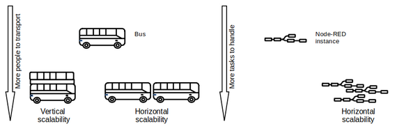
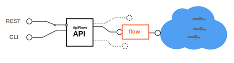
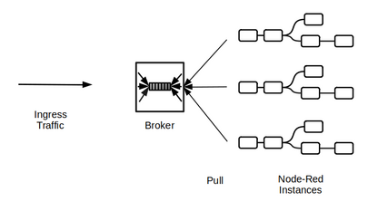
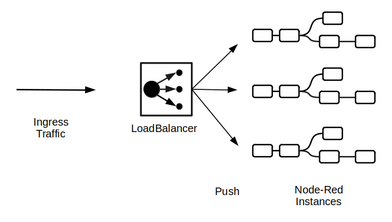
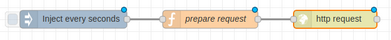
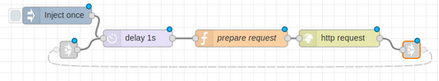
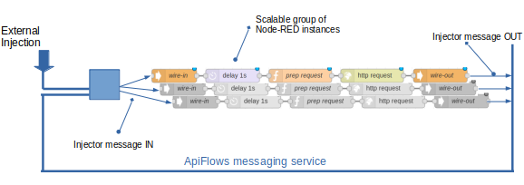

# ApiFlows Concepts

[TOC](./README.md#table-of-content) | [NEXT GUIDE](./Setup.md)

* [What is Node-RED](#what-is-node-red)
* [ApiFlows versus Node-RED](#apiflows-versus-node-red)
* [What is a flow](#what-is-a-flow)
* [studio versus production mode](#studio-versus-production-mode)
* [Ingress traffic management](#ingress-traffic-management)
* [Injection traffic management](#injection-traffic-management)
* [Context sharing](#context-sharing)
* [Observability and dashboarding](#observability-and-dashboarding)

## What is Node-RED
 
 [Node-RED](https://nodered.org/) was created by [IBM Emerging Technologies](https://emerging-technology.co.uk) in 2013 . Member of [JS Foundation](https://js.foundation) since 2016, it is one of the most active OpenSource project in IOT domain. It proposes an intuitive visual programming interface which allows developpers without coding skills to connect thousands of  predefined programming blocks ( named nodes) to perform a task. The resulting program is a combination of input, processing and output nodes wired together as a flow. 
 Although it was originally designed for pure IOT use cases, it has become very usefull for any application which interracts with digital event streams. It's the case in digital social interraction programming area. Some companies uses [Node-RED](https://nodered.org/) to create ChatBots or even more advanced application mixing social interraction ,IOT, and Arificial Intelligence.

 [Back to top](#apiflows-concepts)

## ApiFlows versus Node-RED

[Node-RED](#what-is-nodered) is a great tool but has one limitation. It does neither scale vertically nor horizontally. In other words, it can not consume more than the power of one CPU, on one machine.
It prevents Node-RED from being used in CPU intensive situation or in situation where CPU consumption can be extremly variable . As an example, it cannot be used to develop an IOT supervision application, if the number of Object sending events to he application is ever growing. 

ApiFlows is a SaaS created by ApiValley to make Node-RED horizontally scallable. What does that mean from a user perspective :
* He uses Node-RED visual editor standard functionality  to create a program.
* He let ApiFlows execute in parallel a set of Node-RED engine, which collaborate together to handle tasks.
ApiFlows adapts automatically the number of execution engines, depending on the workload. As the number of execution engines scale up and down, requested hardware infrastructure is automatically and transparently managed by ApiFlows.
* He pays for what he uses when he uses it.

[Back to top](#apiflows-concepts)

## What is a flow

The execution of an horizontally scalable Node-RED program, needs dynamically created infrastructure elements like virtual machines, containers running NodeRED instances, storage, loadBalancers, private network etc ...
To simplify user experience, ApiFlows comes with a resource object called **flow**, which can be created, deleted  and controlled with a REST API and a CLI ( windows, linux, macos). 

A **flow** is a facade resource used by ApiFlows to create and controll all physical and virtual items, involved in the creation and execution of one horizontally scalable Node-Red program.

> So as to avoid any confusion, a clear distinction must be made between the ApiFlows flow facade, and a Node-RED flow which is the formatting of a Node-RED program. In the following, flow will allways design an ApiFlows flow facade while Node-RED program  will be used instead of Node-RED flow.

[Back to top](#apiflows-concepts)

## Studio versus Production mode

A [flow](#what-is-a-apiflows-flow) has a property named **mode**, which can evolve during its lifecycle.
[flow](#what-is-a-apiflows-flow) **mode** can be :
*  **studio**
*  **production** 

At creation time, a [flow](#what-is-a-apiflows-flow) is allways in **studio mode** :
*  The facade object creates one single Node-Red instance in the cloud. User can access its visual editor to edit the program, install and use new programming block ( nodes ),  execute and test it.

As soon as user is satisfied with the program and want to gain horizontal scalability, it can switch the [flow](#what-is-a-apiflows-flow) mode to **production** :
 * The facade object automatically stops  the former single Node-RED instance. It then creates a set of new Node-RED instances without editor. Depending on other [flow](#what-is-a-apiflows-flow) properties, like **autoscaling** or **nb_instances**, the number of Node-RED instances, can be fixed or can vary automatically depending on the workload. So as to handle the monitoring capabilities played by visual editor in **studio** mode, ApiFlows offers a grafana tenant which can be customized by user to monitor his flow. 

[Back to top](#apiflows-concepts)

## Ingress traffic management

### Introduction
A Node-Red program is composed of input nodes, processing nodes, and output nodes .
Input nodes are in charge of receiving event messages comming from the internet of things.Two paradigms of communication can be used to receive messages :

* **pull based reception :** Input node creates an outgoing connection to an external broker really in charge of receiving and buffering messages. Input node  pull messages from the broker on regular basis. Kafka, or mqtt are good examples of pull based reception.

* **Push based reception** : Input node creates itself a server which listen for incoming direct connections. Messages are sent to the input node through one of these connections  . Http is representative of push based reception.

ApiFlows makes Node-RED horizontally scalable. It starts, or stops Node-Red instances, to adapt to increasing or deacreasing workload.

If workload is due to ingress message reception rate. Having more or less instances of Node-RED, without automatically rebalancing the ingress traffic does not solve the  problem.

### ApiFlows solutions to equally balance ingress traffic accross an elastic group of Node-RED instances

It depends on the communication paradigm used by input nodes :

**In pull based reception** : the developer is reponsible for configuring the protocol used to pull messages so as messages buffered by the broker can be consumed equally by the elastic group of Node-RED instances. As an example, kafka input node, must be configured to consume as a kafka consummer Group.

**In push based reception** : ApiFlows itself is in charge of transparently balancing the traffic to Node-RED instances. It creates a loadBalancer with an external address, which can be used to send messages to the set of Node-RED instances it controlls. By default, ApiFlows deals only with http and https ingress traffic. If a low level TCP loadBalancer is needed, customer must contact contact@apiflows.org  

[Back to top](#apiflows-concepts)

## Injection traffic management
### Introduction
In previous chapter, we covered the use cases in which Node-RED workload is due to ingress traffic. It's the case usually when Node-RED acts as a service.

Nevertheless, Node-RED workload isn't allways due to ingress traffic. Node-RED can also be used as an outgoing traffic generator. It's the case when Node-RED is used to simulate a fleet of sensors to test the scalability of an IOT supervision platform ( see tutorial).In these situations, Node-RED is programmed to periodically execute tasks which are not triggered by ingress traffic, but by timer events.

Two famillies of solutions can be used in Node-RED programs  to trigger periodic tasks, based on timer events.

* The first type of solution is to use a [basic inject node](https://nodered.org/docs/user-guide/nodes#inject), and configure it to peridically trigger events.

* The second familly of solution is to create a loop (with link nodes) containing one basic  delay Node.

None of these solutions are adapted to horizontal scalability. The main reason being that timer events are local to each Node-RED instances. They cannot be shared accross the elastic group of Node-RED instances executing the program.

>Imagine, you want to increase the workload of such a Node-RED program. You have to increase the rate of timing events (by decreasing delay ) and restart your Node-RED instance. What happens when your Node-RED instance workload is near consumming an entire CPU ? ApiFlows will scale horizontally and create a new Node-RED instance. Nevertheless, since timer events are local to each Node-RED instances with the same static delay period, the second Node-RED instance will near immediately consume an entire CPU, which will triggers the creation of a third Node-RED instance by ApiFlows, etc ... Instead of sharing workload, it is multiplied by the number of created Node-RED instances.

### ApiFlows solution  to deal with horizontal scalability of timer event driven NodeRED programs.

ApiFlows brings two additional Node-RED nodes, named **wire-in** and **wire-out**. They are used to respectively receive and send messages called **injector messages**, between Node-RED instances, through a private network named **ApiFlows messaging service** . 

Each ApiFlows user, has his own dedicated **ApiFlows messaging service** private network, shared by all the Node-RED instances of all [flows](#what-is-a-apiflows-flow), he created.  

As a receiver, **wire-in** node has an address composed by the name of the [flow](#what-is-a-apiflows-flow) in which it resides, and an additional property named **pin_name**. When receiving an injector message, wire-in role is to transmit the message to the downstream node in the Node-RED program.

As a sender, **wire-out** node must define a target address, made of a **target_flow_name** and a **target_pin_name**.

Not only can an **injector message** be sent from a **wire-out**  but it can also be injected in **ApiFlows messaging service** network, by the way of **external injection**. (see context sharing )

The address of a **wire-in** contained in a Node-RED program, is shared by all the Node-RED instances belonging to the elastic group in charge of executing  the same program, because they belongs to the same [flow](#what-is-a-apiflows-flow), and have the same **pin_name**

Each time injection messages are sent to this address by a **wire-out** or by **external injection** , **ApiFlows messaging service** garanty the following :
* messages are received by at least one and only one Node-RED instance of the elastic group executing the program
* messages are equally balanced accross Node-RED instances executing the program

Let's explain now, why **ApiFlows messaging service** brings horizontal scalability for timer event driven Node-RED program.

### To increase workload

 no more need to decrease the static  delay period. It can be set to a fixed value like  1 second . Workload can be controlled instead by external injection. 

Imagine you have only one Node-RED instance, executing the program.

 * You first inject one **injector message** with external injection. The workload becomes "one task per second" ( because the delay is 1 second and the unique injector message is looping continuously from wire-out to wire-in).
 * If you inject a second **injector message** , the workload becomes "2 tasks per second".
* After injection of several hundred **injector messages**, workload is no more sustainable by one Node-RED instance. ApiFlows automativally creates a new Node-RED instance.
* Thanks to ApiFlows messaging service, looping injector messages are immediately balanced between the two Node-RED instances. Each Node-RED instance supports half the workload.

### To decrease workload
 ApiFlows brings a way to eject **injector message** from the ApiFlows messaging service network.
Each **injector message** has a unique key, which corresponds to a **shared context** ( see Context Sharing). When a wire-in node receives an **injector message** it reads the **shared context** corresponding to the key. A shared context has a property named **state**. If **state** is **STOPPED**, wire-in node does not transmit injector message to the downstream node in the program. The immediate effect is to eliminate the injector message from the circuit and as a consequence decrease the global workload. 

If the global workload becomes sustainable by a unique Node-RED instance, ApiFlows stop gracefully one Node-RED instance. The stopped Node-RED instance, is first denied the possibility of receiving injector messages. A gracefull period is then let to the stopped Node-RED instance (before being killed), to transmit all previous received message through its wire-out nodes. At the end of the gracefull period, none of the looping injector message is lost. The workload remain the same, but is handled by a unique Node-RED instance.

[Back to top](#apiflows-concepts)

## Context sharing

As explained in preceding chapters, ApiFlows is capable of sharing equally the workload accross an elastic group of Node-RED instances executing the same program. To do that, it balances ingress messages and injector messages accross the Node-RED instances. Nothing allows to know in advance, which Node-RED instance, will handle which message. It can be a problem, if the message is associated with a context.

It's the reason why ApiFlows comes with a shared context service.
Shared context service is a way to centralize the management of contexts. Contexts are no more stored locally in each Node-RED instance. They are shared. Each ApiFlows user has his own dedicated  Shared Context service, shared by all the Node-RED instances of all [flows](#what-is-a-apiflows-flow), he created.

A context is addressed by a unique key. It contains a json value, made of two properties :
* state : string value. Only "STOPPED" value is meaningfull for wire-in node ( see bellow)
* context : opaque json structure which has no direct meaning for ApiFlows

There are three ways to consume Shared Context service :

* APiFlows API and CLI enables all CRUD operations .It's the only way to create shared contexts.
* wire-in ApiFlows node-RED node : As explained in preceding chapter, an **injector message** has a unique key, which must corresponds to a **shared context** . When a wire-in node receives an **injector message**, it reads the **shared context** corresponding to the key. If the shared context does not exist or is in STOPPED state, wire-in node does not transmit the message to its downstream node. , Else, it adds two parameters to the message , zm_context and zm_state respectively being the context, and  state parameter  of the context object. It then transmit the augmented message to it downstream node.   
* Context ApiFlows node-RED node : ApiFlows brings an additional Node-RED node , named **Context** to read, and modify a shared context, from a Node-RED program.

[Back to top](#apiflows-concepts)

## Observability and Dashboarding

[Back to top](#apiflows-concepts)

[TOC](./README.md#table-of-content) | [NEXT GUIDE](./Setup.md)