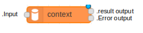
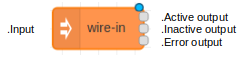
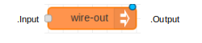
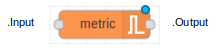

# ApiFlows NodeRED nodes

[Back to References](../References.md) | [TOC](../README.md)

## **ApiFlows context node** 



```
This node is used to read, update, or delete a shared context from a NodeRED flow.
It appears in palette in category ApiFlows  under the name ApiFlows context.
```


One input message :
* must contain **af_contextid** field for any operation
* must contain **af_context** field for **SET** operation
* must contain **af_state** field for **TOSTATE** operation

Two output messages : **error** and **result**
* error output message is sent in case of context processing error. It has the same content  as input message except **error** field which contains the error which occured during context processing
* result output message is sent in case of context processing success. It has the same content as input message except **af_context** which potentially changed during a **GET** operation.

Two parameters :

* name : label of node as it appears in the flow
* operation : can be GET, SET, DELETE, TOSTATE

Four operations :

**GET** is used to read the context with af_contextid ID. The read result is put into **af_context** field of result output.

**SET** is used to update the content of the context with **af_contextid** ID. New context value is taken from **af_context** input message field.

**DELETE** is used to delete the content of the context with **af_contextid** ID.

**TOSTATE** is used to change the **state** of context with **af_contextid** ID. New state value is taken from **af_state** input message field.

## **ApiFlows wire-in node**



```
This node is used to receive an injector message sent on ApiFlows messaging network. 
It appears in palette in category ApiFlows  under the name ApiFlows wire-in.
```

one input  :

* must contain **af_contextid** field


Three outputs :
* **active** output message is sent if input message contains **af_contextid** field, and context data for this context ID is not empty, and context state for this context ID is **NOT STOPPED**. It has the same content as input message except **af_context** and **af_state** which respectively contain context data and context state values for **af_contextid** ID. 

* **inactive** output message is sent if input message contains **af_contextid** field, and context data for this context ID is not empty, and context state for this context ID is **STOPPED**. It has the same context as input message except **af_context** and **af_state** which respectively contain context data and context state values for **af_contextid** ID.

* **error** output message is sent if input message does not contain **af_contextid** field, or context data for this context ID is empty, or error occured during read operation for this context ID. It has the same context as input message except **error** field which contains the error which occured during read context operation of **af_contextid** ID. 

Two parameters :

* **name** : label of node as it appears in the flow
* **pin_name** : address of the wire-in input node in ApiFlows messaging network.


## **ApiFlows wire-out node**



```
This node is used to send an injector message on the ApiFlows messaging service network.
It appears in palette in category **ApiFlows**  under the name **ApiFlows wire-out**.
```

one input  :

* must contain **af_contextid** field

Two parameters :

* **name** : label of node as it appears in the flow
* **target_pin_name** : address of the wire-in input node in ApiFlows messaging network.


## **ApiFlows metric node**



```
This node is used create and feed metrics. Metrics are collected, aggregated and made available in a grafana tenant at the following address : https://grafana.apivalley.org
The node appears in palette in category ApiFlows  under the name ApiFlows wire-in.
```

Five parameters :

* **name** : label of node as it appears in the flow
* **metric_type** : Can be chosen among **Counter**, **Gauge**, **Histogram**, **Summary**
* **value** : Is not mandatory for counter ( Only value 1 is possible for counter and is set by default). Gauge accept negative values.
* **buckets** : 
* **percentiles** :


[Back to References](../References.md) | [TOC](../README.md)