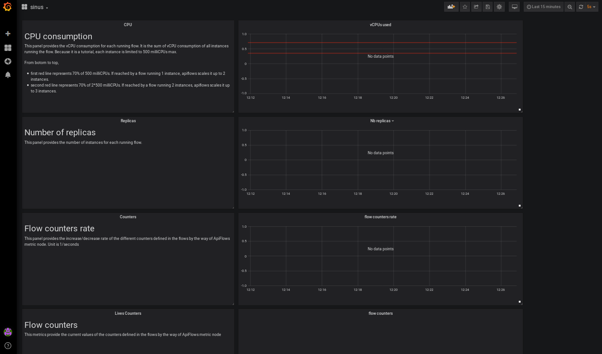
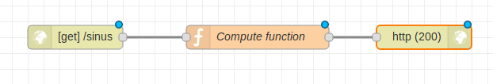
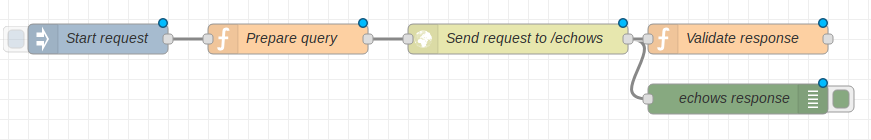
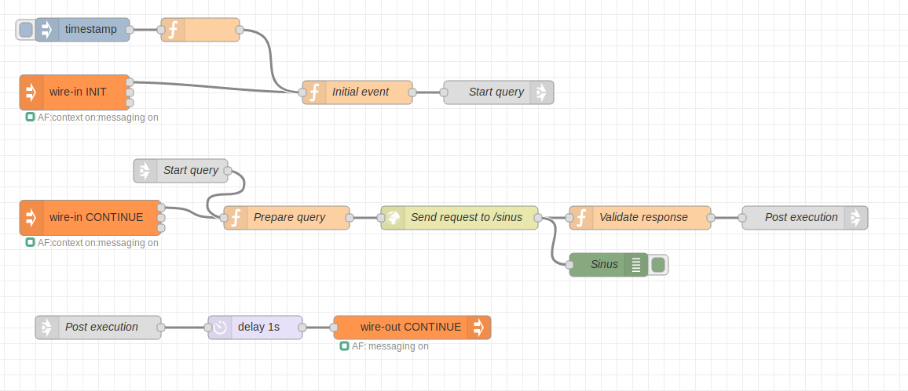
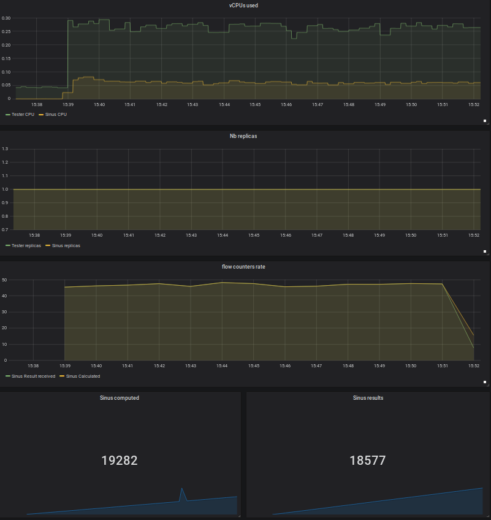

# ApiFlows Tutorial

[TOC](./README.md#table-of-content) 

* [Introduction](#introduction)
* [Prerequisites](#prerequisites)
* [CLI authentication setup](#cli-authentication-setup)
* [Deploy tester and echows flow in SDK mode](#deploy-tester-and-echows-flows-in-sdk-mode)
* [Deploy tester and echows flows in MULTI mode to gain horizontal scalability](#deploy-tester-and-echows-flows-in-multi-mode-to-gain-horizontal-scalability)


___


## Introduction

This tutorial aims at introducing each feature provided by ApiFlows :
* deploy Node-RED in the cloud . 
* Use injection traffic to trigger more or less Node-RED workload
* scale Node-RED horizontally to adapt hardware requirements to the workload, using container orchestration, traffic distribution with load balancing and contexts sharing over the parallel instances
* Central monitoring of an elastic group of Node-RED instances thru a Grafana tenant dashboard.

To illustrate all those aspects, we are going to use :
* A first ApiFlows flow named echows, acting as a web service. The service logic is very simple: it receives a request containing two parameters:
  * message_to_be_echoed
  * cpu_blocking_time_duration

  The CPU is artificially blocked during cpu_blocking_time_duration by the way of the cpu-loader node, then message_to_be_echoed is sent back in the http response


* A second ApiFlows flow named tester, acting as a web client , to test echows web service. We will make it evolve from a basic functional tester sending just a request, to a complex one, able to load test the tester web service while managing contexts.

Let's us guide you ...


___

## Prerequisites


* send an email to contact@apivalley.org 
* receive back a procedure to create a user and schedule a tutorial event .
* schedule a tutorial event
* receive a tutorial event scheduling confirmation
* install CLI
  ```bash
  $ mkdir TUTO; cd TUTO
  $ git clone https://github.com/ApiValley/ApiFlows-CLI.git
  $ chmod +x ApiFlows-CLI/linux/apiflows
  $ export PATH=<PATH-TO-TUTO>/TUTO/ApiFlows-CLI/linux:$PATH
  $ apiflows --help
  Usage: apiflows [options] [command]

  ApiFlows CLI

  Options:
    -V, --version    output the version number
    -h, --help       output usage information

  Commands:
    init|i           get credentials from ApiFlows
    user|u           create ,modify, or delete ApiFlows users
    account|a        create ,modify, or delete ApiFlows accounts
    subscription|su  create ,modify, or delete ApiFlows subscriptions
    flow|fl          create ,modify, or delete ApiFlows flows
    context|c        create ,modify, delete, start or stop  ApiFlows contexts
    help [cmd]       display help for [cmd]

  ``` 
* Clone ApiFlows-Docs github repository containing tutorial materiel

  ```bash
  $ cd TUTO
  $ git clone https://github.com/ApiValley/ApiFlows-Docs.git
  ```

* Wait for tutorial event starting time . ApiFlows team will have started ApiFlows service, so as you can run the tutorial, with or without assistance


___

## Setup


### **step_0**: apiflows CLI initialization and grafana tenant Dashboard setup ( 2 minutes)

* Action1
  ```bash
  $ cd TUTO/ApiFlows-Docs
  $ apiflows init
  apiflows init
  ApiFlows login: regnauch@gmail.com
  ApiFlows password: *********

  retrieved access_token eyJ0eXAiOiJKV1QiLCJhbGciOiJSUzI1NiIsImtpZCI6Ilg1ZVhrNHh5b2pORnVtMWtsMll0djhkbE5QNC1jNTdkTzZRR1RWQndhTmsifQ.eyJpc3MiOiJodHRwczovL2FwaWZsb3dzLmIyY2xvZ2luLmNvbS9jZWQ1Njc1ZC04YmNlLTQ5ODAtOTAyZS02YTU5OGM4YmFhYTMvdjIuMC8iLCJleHAiOjE1NzEzMDk2NTQsIm5iZiI6MTU3MTMwNjA1NCwiYXVkIjoiNWI0Yzg2YzgtNTJjOS00YmZkLWFhODktN2QyNzJkZDhmZTMxIiwiaWRwIjoiTG9jYWxBY2NvdW50Iiwib2lkIjoiNDVkYzkyYTYtNDNjZS00ZGFhLThkYzAtZGI3OGViMmVjMDIyIiwic3ViIjoiNDVkYzkyYTYtNDNjZS00ZGFhLThkYzAtZGI3OGViMmVjMDIyIiwiZ2l2ZW5fbmFtZSI6ImNoYXJsZXMiLCJmYW1pbHlfbmFtZSI6InJlZ25hdWx0IiwibmV3VXNlciI6ZmFsc2UsImVtYWlscyI6WyJyZWduYXVjaEBnbWFpbC5jb20iXSwidGZwIjoiQjJDXzFfUk9QQyIsImF6cCI6IjViNGM4NmM4LTUyYzktNGJmZC1hYTg5LTdkMjcyZGQ4ZmUzMSIsInZlciI6IjEuMCIsImlhdCI6MTU3MTMwNjA1NH0.g2oadHv5Yqy-FQfbBjI9R0e1YtsMHUPzwfoJpvemTzASRHXw1d_ChmJ81kXNu4tiirQVwMyg4Y1NZK8D9PWRwuWPs3l4q6JvJ6xn1Tv9iJcAUfSWke6UYhnjCzMquJ5g8Nm9_hEXtN6E2p2WgNxRk8EynLdhx7q_nje2dGDyzruaaQGUtWV1CyYddt8iW9aNutep0LCUG5_N7Tj6M5sh2GbIY3TIjFkXM5n2MQT-SxWpqyTaXVqUB8fXbFNDXXSFgm47GBwMtYP8KTss6_i7DohMlLZxLNCPEbHYx3FGdeRMF22AkoeprrHD8ep17FgWtycQG9dc4bS-ycgdbkV6JQ
  User = { userId: 'o9eslaai', accountId: 'o9eslaai-a' }
  ```
* Result1
  
  One access token is generated by ApiFlows and saved in .apiflows.json file in your HOME directory.
  The token is used by apiflows CLI to authentify itself against ApiFlows service.

  **Be carefull** : The token validity time is limited. You may have to launch **apiflows init** again if you start facing authentication error while using the CLI.

      error { statusCode: 401, message: 'Unauthorized' }
  

* To be noticed1

  A json User object is returned by **apiflows init** :

      User =  { userId: 'o9eslaai', accountId: 'o9eslaai-a' }

  In the following tutorial steps, two parameters will be used:
  * \<**userId**\> : takes the value of User.userId json property returned by apiflows init. 
  * \<**accountId**\> : takes the value of User.accountId json property returned by apiflows init. 

  Example : for charles.regnault@apivalley.org above

    \<userId\>=o9eslaai

    \<accountId\>=o9eslaai-a


* Action2 

  * Access your grafana tenant and open the tutorial dashboard ( 5 minutes )

    * With your browser Navigate to https://grafana.zmeter2.apivalley.org
    * Because it's only for trial, the communication with ApiFlows grafana service is secured with a self-signed certificate. Your browser will warn you about a potential security issue. Depending on your web browser , you will have to accept this risk to continue.
    * Wen prompted to log in, enter your userId as user and your accountId as password. You will be able to change your password immediately after your first connexion .
    * Click on **tutorial** Dashboard to open it
    
* Result2

  

    tutorial Dashboard contains 4 panels :

    * **CPU consumption:**

      This panel provides the vCPU consumption for each running flow. It is the sum of vCPU consumption of all instances running the flow. Because it is a tutorial, each instance is limited to 500 milliCPUs max.
      
      From botom to top,

      *  first red line represents 70% of 500 milliCPUs. If reached by a flow running 1 instance, apiflows scales it up to 2 instances.
      
      * second red line represents 70% of 2*500 milliCPUs. If reached by a flow running 2 instances, apiflows scales it up to 3 instances.

    * **Number of Replicas**

      This panel provides the number of instances for each running flow.

    * **Flow counters rate**

      This panel provides the increase/decrease rate of the different counters defined in the flows by the way of ApiFlows metric node. Unit is 1/seconds

    * **Flow counters**

      This panel provide the current values of the counters defined in the flows by the way of ApiFlows metric node


___
## Deploy tester and echows flows in SDK mode
### **step_1**: create echows ApiFlows flow ( 5 minutes )

* Action1

  ```bash
  $ apiflows flow create --flowId echows
  response { statusCode: 200,
  type: 'application/json',
  body: 
   { userId: 'o9eslaai',
     accountId: 'o9eslaai-a',
     SDK_web_URL: 'http://echows.o9eslaai.apivalley.org' } }
  ```
* Result1
 
  * CLI return a response with a json body object containing the following properties :

    * \<userId\> : o9eslaai   ( same as returned by apiflows init command)
    * \<accountId>: o9eslaai-a ( same as returned by apiflows init command )
    * \<SDK_web_URL\>: http://echows.o9eslaai.apivalley.org ( address of echows flow web editor)

  * A Node-RED instance is started in the cloud with a web editor reachable at the address : \<SDK_web_URL\>

    In the example above, web editor address is http://echows.o9eslaai.apivalley.org  .
  * A Node-RED storage dedicated to the flowId echows is created in the cloud, to store everything related to the Node-RED program:
  
    * Node-RED node modules installed from the palette
    * Node-RED flow deployed in the Node-RED instance
* Action2

  
  + Wait for 1 to 2 minutes for echows Node-RED instance to be deployed in the cloud then use your web browser to navigate to echows Node-RED web editor. To be aware when echows Node-RED editor is available, you have two possibilities :
    * you can observe the **Nb Replicas** panel of grafana echows Dashboard. Nb Replicas for echows flow must change from 0 to 1.
    * You can use the following command to observe **flowStatus** property 
    ```
      $ apiflows flow get --flowId echows
      response { statusCode: 200,
      type: 'application/json',
      body: 
      { userId: 'o9eslaai',
        accountId: 'o9eslaai-a',
        subscriptionId: 'o9eslaai-s',
        simulationId: 'echows',
        mode: 'sdk',
        replicas: 1,
        availableReplicas: 1,
        flowStatus: 'ready',
        service: 'on',
        ingress: 'on',
        autoscaler: 'off',
        configmap: 'on' } }
      ```
* Action3

  + Use echows Node-RED web editor to import and deploy the following json flow :  [flowBasicService](https://github.com/ApiValley/ApiFlows-Docs/blob/master/flows/NodeRedBasicService.json) 

* result3

  The following Node-RED flow is deployed 

  

  It contains (from left to right)

  * a Http input node which receives http request sent to http://echows.\<userId\>.apivalley.org/echows

  * a function node to compute echows based on request parameter value

  * a debug node to print echows value as soon as it is computed

  * a APiFlows **metric** node, to create and feed a counter metric to count the number of computed echows

  * a httpResponse node, to send back the result in a http response

  


### **step_2**: create tester ApiFlows flow ( 5 minutes )
* Action1

  ```bash
  $ apiflows flow create --flowId tester
  response { statusCode: 200,
  type: 'application/json',
  body: 
   { userId: 'o9eslaai',
     accountId: 'o9eslaai-a',
     SDK_web_URL: 'http://tester.o9eslaai.apivalley.org' } }
  ```
* Result1
 
  * CLI return a response with a json body object containing the following properties :

    * \<userId\> : o9eslaai   ( same as returned by apiflows init command)
    * \<accountId>: o9eslaai-a ( same as returned by apiflows init command )
    * \<SDK_web_URL\>: http://tester.o9eslaai.apivalley.org ( address of tester flow web editor)

  * A Node-RED instance is started in the cloud with a web editor reachable at the address : \<SDK_web_URL\>

    In the example above, web editor address is http://tester.o9eslaai.apivalley.org  .
  * A Node-RED storage dedicated to the flowId tester is created in the cloud, to store everything related to the Node-RED program:
  
    * Node-RED node modules installed from the palette
    * Node-RED flow deployed in the Node-RED instance
* Action2

  
  + Wait for 1 to 2 minutes for tester Node-RED instance to be deployed in the cloud then use your web browser to navigate to tester Node-RED web editor. To be aware when tester Node-RED editor is available, you have two possibilities :
    * you can observe the **Nb Replicas** panel of grafana tutorial Dashboard. Nb Replicas for tester flow must change from 0 to 1.
    * You can use the following command to observe **flowStatus** property 
    ```
      $ apiflows flow get --flowId tester
      response { statusCode: 200,
      type: 'application/json',
      body: 
      { userId: 'o9eslaai',
        accountId: 'o9eslaai-a',
        subscriptionId: 'o9eslaai-s',
        simulationId: 'tester',
        mode: 'sdk',
        replicas: 1,
        availableReplicas: 1,
        flowStatus: 'ready',
        service: 'on',
        ingress: 'on',
        autoscaler: 'off',
        configmap: 'on' } }
      ```
* Action3
  + Use tester Node-RED web editor to import and deploy the following json flow :  [flowBasicTester](http://github.com/ApiValley/ApiFlows-Docs/blob/master/flows/NodeRedBasicTester.json)
  
 

* result3

  The following Node-RED flow is deployed 

  

  It contains (from left to right)

  * a Node-RED injector node. It can be used to trigger the flow, by just clicking 

  * a function node to prepare http request content

  * a Node-RED http request node, to send the request to echows web service
  
  * a function Node-RED node to check the content of http response

* action4

  * double click on http-request node-RED node to edit its properties
  * modify URL : replace echows.mvcbasu9.apivalley.org by echows.\<userId\>.apivalley.org where \<userId\> is the value you noticed in step0
  * save change by clicking on **Done**
  * Deploy your change by clicking on **Deploy**

  
### **step_3**: send one request from tester to echows ( 5 minutes )
* Action

  * Navigate to tester web editor
  * click two times on injector node button
* Result

  * Two requests were sent to echows web service
  * It can be checked by navigating to echows web editor and look at logs produced by the debug node. Two echows were computed


### **step_4**: Modify tester flow to use traffic injection capability (2  minutes ) 
* Action1

  + Use tester Node-RED web editor to import and deploy the following json flow :  [flowLoadTester](https://github.com/ApiValley/ApiFlows-Docs/blob/master/flows/NodeRedTesterLoadStep2.json)

* Result1

  The following Node-RED flow is deployed 

  

  What are the changes between flowBasicTester and flowLoadTester

  * one ApiFlows wire-in node with pin_name=INIT was added to inject **injector messages** from outside by the way of apiflows CLI

  * one ApiFlows wire-in node with pin_name=CONTINUE and one ApiFlows wire-out node with target_pin_name=CONTINUE was added to make injector messages loop through Node-RED instances running tester flow.

  * One delay Node-RED node set to 1s , to define the number of loop per second of each injected message.
  
  With such a program, we can expect sending one http request per second per external injected message.

* Action2

  * double click on http-request node-RED node to edit its properties
  * modify URL : replace echows.mvcbasu9.apivalley.org by echows.\<userId\>.apivalley.org where \<userId\> is the value you noticed in step0
  * save change by clicking on **Done**
  * Deploy your change by clicking on **Deploy**


### **step_5**: Use injection traffic to controll http traffic rate ( 2 minutes )
* Action1
  ```
  $ apiflows context create --flowId tester --nb 5 --groupId group1   --file flows/contextsTemplate.json

  $ apiflows context create --flowId tester --nb 5 --groupId group2  --file flows/contextsTemplate.json

  ```
* Result1

  * two groups of shared contexts were created in ApiFlows shared context service
  * We are ready to inject **injector message** associated with these contexts, from the CLI to tester flow
* Action2
  ```bash
  $ apiflows context start --flowId tester --groupId group1 --wireIn INIT
  ```

* Result2

  * 5 injector messages belonging to group1 ,were sent to wire-in INIT node of tester flow,from the CLI.
  * Grafana dashboard observations:

    * In **Flows counter** panel, we can see that near 5 echows request per second are computed. It means that injection traffic on tester side, triggers http traffic on echows side.


* Action3
  ```bash
  $ apiflows context start --flowId tester --groupId group2 --wireIn INIT
  ```


* Result3


  * 5 new injector messages belonging to group2  were sent to wire-in INIT node from the CLI.
  * Grafana dashboard observations:

    * In **Flows counter** panel, we can see that near 10 echows requests per second are computed. 

### **step_6**:  Use shared context to make http request content vary (5  minutes ) 
* Action
* Result
* To be noticed


___

## Deploy tester and echows flows in MULTI mode to gain horizontal scalability

### **step_7**: switch tester ApiFlows flow in multi mode 
* Action1
  
  * create json file flows/testerMulti.json with the following content

  ```json
  {
   "mode": "multi",
   "autoscale": true,
   "minReplicas": 1,
   "maxReplicas": 3
  }
  ```

* Action2

  ```bash
  $ apiflows flow modify --flowId tester --file flows/testerMulti.json
  ```

* Result2

  * tester Node-RED web editor is disconnected, because SDK Node-RED instance is stopped
  * One new Node-RED instance is started , without editor
  * autoscale is on. ApiFlows is capable to scale the flow horizontally if needed ( up or down )
  * Look at Nb Replicas Panel in tutorial grafana Dashboard. Nb replicas of tester flow is first going from 1 to 0, when SDK is stopped, then goes from 0 to 1, when first instance of multi tester flow is available. Please wait for first multi instance to be available before going to step 9. 


### **step_8**: switch echows ApiFlows flow in multi mode
* Action1
  
  * create json file flows/echowsMulti.json with the following content

  ```json
  {
   "mode": "multi",
   "autoscale": true,
   "minReplicas": 1,
   "maxReplicas": 3
  }
  ```

* Action2

  ```bash
  $ apiflows flow modify --flowId echows --file flows/echowsMulti.json
  ```

* Result2

* echows Node-RED veb weditor is disconnected, because SDK Node-RED instance is stopped
  * One new Node-RED instance is started , without editor
  * autoscale is on. ApiFlows is capable to scale the flow horizontally if needed ( up or down )
  * Look at Nb Replicas Panel in tutorial grafana Dashboard. Nb replicas of echows flow is first going from 1 to 0, when SDK is stopped, then goes from 0 to 1, when first instance of multi echows flow is available. Please wait for first multi instance to be available before going to step 9. 


{ statusCode: 200,
  type: 'application/json',
  body: 
   [ { userId: 'o9eslaai',
       accountId: 'o9eslaai-a',
       subscriptionId: 'o9eslaai-s',
       simulationId: 'echows',
       mode: 'multi',
       replicas: 1,
       availableReplicas: 1,
       flowStatus: 'ready',
       service: 'on',
       ingress: 'on',
       autoscaler: 'on',
       minReplicas: 1,
       maxReplicas: 3,
       targetCPUUtilizationPercentage: 70,
       configmap: 'on' },
     { userId: 'o9eslaai',
       accountId: 'o9eslaai-a',
       subscriptionId: 'o9eslaai-s',
       simulationId: 'tester',
       mode: 'multi',
       replicas: 1,
       availableReplicas: 1,
       flowStatus: 'ready',
       service: 'on',
       ingress: 'on',
       autoscaler: 'on',
       minReplicas: 1,
       maxReplicas: 3,
       targetCPUUtilizationPercentage: 70,
       configmap: 'on' } ] }


### **step_9**: Increase injection traffic by steps, and observe how tester and echows flows are scaling up
* Action1
  ```
  $ apiflows context create --flowId tester --nb 100 --groupId groupA --file flows/contextsTemplate.json
  $ apiflows context create --flowId tester --nb 100 --groupId groupB --file flows/contextsTemplate.json
  $ apiflows context create --flowId tester --nb 100 --groupId groupC --file flows/contextsTemplate.json
  ```


* Action2
  ```
  $ apiflows context start --flowId tester --groupId groupA --wireIn INIT
  ```

* Result2

  Let's wait for 5 minutes and observe grafana tutorial Dasboard :
  


* Action3
  ```
  $ apiflows context start --flowId tester --groupId groupB --wireIn INIT
  ```

  * Result3

  Let's wait for 5 minutes and observe grafana tutorial Dasboard :
  

  * Action4
  ```
  $ apiflows context start --flowId tester --groupId groupC --wireIn INIT
  ```

  * Result4
  Let's wait for 5 minutes and observe grafana tutorial Dasboard :
  

* To be noticed

### **step_10**: Decrease injection traffic by steps, and observe how tester and echows flow are scaling down
* Action1
  ```
  $ apiflows context stop --flowId tester --groupId groupA
  ```

* Result1

* Action2
  ```
  $ apiflows context stop --flowId tester --groupId groupB
  ```

* Result2

* Action3
  ```
  $ apiflows context stop --flowId tester --groupId groupC
  ```

* Result3

* To be noticed

 
___


 


## Delete the contexts

The contexts can be removed from running loop with the command delete applied to each group:
```
$ apiflows context delete --flowId tester --groupId group1
$ apiflows context delete --flowId tester --groupId group2
$ apiflows context delete --flowId tester --groupId group3
```

Scale down may take 5 minutes to happened. It waits for this duration to confirm the need to scale down. 
So, Wait more than 5 minutes between the different context deletion to observe the impact in terms of CPU, and scale down.


## Switch back flows in SDK mode

During multi instances mode, the graphical is not accessible to update the flow. If needed, after deleting the contexts, you can switch back to the SDK mode by running the flollowing commands:

```
$ apiflows flow modify --flowId tester --file flows/testerSDK.json
$ apiflows flow modify --flowId sinus --file flows/sinusSDK.json
```
the Multi instances will stop and a new SDK instance should start. You can access again the graphical interface and edit your flow.


## Flows stop

To stop the flows, just delete the ApiFlows flow object. Run the commands:
```
$ apiflows flow delete --flowId tester
$ apiflows flow delete --flowId echows
```


 [Back to top](#apiflows-concepts)
