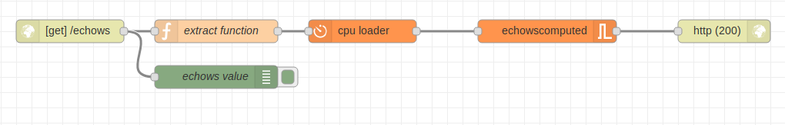
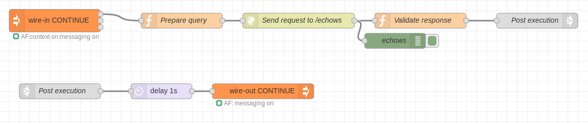

# ApiFlows Tutorial

[TOC](./README.md#table-of-content) 

* [Objectives](#objectives)
* [ApiFlows flows initialisation](#apiflows-flows-initialisation)
* [Node-RED basic flow](#node-red-basic-flow)
* [Node-RED basic functional tester](#node-red-basic-functional-tester)
* [ApiFlows load tester](#apiflows-load-tester)
* [ApiFlows load tester step1](#apiflows-load-tester-step1)
* [ApiFlows load tester step2](#apiflows-load-tester-step2)
* [ApiFlows load tester step3](#apiflows-load-tester-step3)
* [Contexts injection](#contexts-injection)
* [ApiFlows scalability](#apiflows-scalability)
* [Inject contexts](#inject-contexts)
* [Monitoring](#monitoring)
* [Delete the contexts](#delete-the-contexts)
* [Switch back flows in SDK mode](#switch-back-flows-in-sdk-mode)
* [Flows stop](#flows-stop)


## Objectives

This trial aim to introduce step by step the different features provided by ApiFlows: a graphical interface to develop services based on Node-RED, horizontal scalability to adapt the service capacity to the demand using container orchestration, traffic distribution with load balancing and contexts shared over the parallel instances, and application monitoring thru Grafana dashboard.

To illustrate all those aspects, we are going to develop a web service, as an ApiFlows flow, to compute the trigonometric sinus value of an angle provided as parameter in the http request. So, the service logique will be very simple: it receives a request, extract the angle from the parameters, compute the sinus, increment a counter to monitor the number of requests processed, and send back the result.

Then, we'll develop another ApiFlows flow to test the sinus service step by step, starting from a basic tester flow sending just a request to a full load testing managing a group of context, sending one different request per context and per second.


## ApiFlows flows initialisation

The first step is to create the two flows required for this tutorial to be able access the Node-RED instances for the sinus service and the tester. 
First, initialize the communication with ApiFlows by running the command:
```
$ apiflows init
```
you'll be prompted for your email and password as you set when you created your account.

Then, you can create the two flows by running:
```
$ apiflows flow create --flowId sinus
$ apiflows flow create --flowId tester
```

Those two commands will instantiate two Node-RED that you'll be able to access using the links: 
```
http://sinus.youruserid.apivalley.org
http://tester.youruserid.apivalley.org
```
where youruserid is the value of the field userId returned in the result of the command:
```
$ apiflows user list
```

In can take one minute for the instances to become up and running.
At this point, we are ready to start developping flows. Let start with the sinus service flow.

## Node-RED basic flow

Open a web browser with the link: http://sinus.youruserid.apivalley.org

Node-RED already has many different connectors/nodes to implement multiple kind of flows. It can act as a web server to provide a web service. The sinus flow aim to compute the sinus of an angle provided in the http request's parameters. For this logic, a first node will receive the incoming http request at the entry point "/sinus", an other one will extract the parameter and compute the sinus, and a last node will send back the result. An additional node will be required to increment a metric's counter to monitor the number of requests processed.

The resulting flow should be:



The flow file in json format can be downloaded at: [NodeRedBasicService.json][flowBasicService]

[flowBasicService]:https://github.com/ApiValley/ApiFlows-Docs/blob/master/flows/NodeRedBasicService.json "sinus service json file"

Note: To import the flow in your Node-RED instance, follow the instructions [here][importNodeRED] 
Note: Each time a flow is updated in the graphical interface, deploy MUST be done to push the flow to the Node-RED processing. The deploy button is in the upper right corner of the Node-RED page. Follow the instructions [here][deployNodeRED] 

[importNodeRED]: https://nodered.org/docs/user-guide/editor/workspace/import-export "Node-RED import/export"
[deployNodeRED]: https://nodered.org/docs/tutorials/first-flow#5-deploy "Node-RED deploy"


The sinus service can be reached using the NodeRed host name and the path /sinus:
```
"http://flowId.accountId.apivalley.org/sinus?q=32151.1"
```
where the flowId is the one you set when you created the flow, sinus in this case,
and the accountId can be found using the command: 
```
$ apiflows user list.
```


## Node-RED basic functional tester

Open a web browser with the link: http://tester.youruserid.apivalley.org

The same principle can used to validate the web service. A flow can be embedded in the same flow as a new tab or can be a flow on its own.


The flow file in json format can be downloaded at: [NodeRedBasictester.json][flowBasicTester]

[flowBasicTester]: flows/NodeRedBasicTester.json "tester flow json file"

Now, a request to the service can be generated by clicking on the Start Request inject node. Its capacity to generate traffic is very limited and not flexible. This is why we are introducing 


## ApiFlows load tester

The basic functional tester can be enhanced to generate a traffic on demand, for numerous different contexts objects and to capture some metrics to monitor the test execution.


## ApiFlows load tester step1

ApiFlows wire-in and wire-out nodes are introduce to offer the capacity to maintain a context state alive for a given context. The context can continue during the full test duration.

Introduce a wire-in node to start a request based on context injection:


The flow file in json format can be downloaded at: [NodeRed load tester step 1.json][nrloadtest1]

[nrloadtest1]: flows/NodeRedTesterLoadStep1.json "tester flow json file with wire-in"

This requires to send one Injector message for each request sent to the service. 

Lets send one Injector message. First, dowload the contexts data template : [contextsTemplate.json][contextstemplate]

[contextstemplate]: flows/contextsTemplate.json "contexts data template file"

Then run the two following commands to create 1 context in one group, and inject it with the entry name INIT:
```
$ apiflows context create --flowId tester --nb 1 --groupId group1 --file flows/contextsTemplate.json
$ apiflows context start --flowId tester --groupId group1 --wireIn INIT
```

In the tester SDK Node-RED, the debug message should appear :


and if you expand the result data object, you should see the result returned by the sinus service:
 


In the payload of the result, angle=0 is the angle, and sinus=0 is the resulting sinus value.

and finally, contexts can be removed from running loop with the command:
```
$ apiflows context delete --flowId tester --groupId group1 
```


## ApiFlows load tester step2

Using an Injector message from a wire-out node to a wire-in node allows the traffic to continue/loop untill needed: 



The flow file in json format can be downloaded at: [NodeRed load tester step 2.json][nrloadtest2]

[nrloadtest2]: flows/NodeRedTesterLoadStep2.json "tester flow json file with wire-out, wire-in loop"

We introduce a delay to avoid the flow to loop forever without any control. For each context injected, there will be one request per second in this example.


## ApiFlows load tester step3

For now, the request sent to the service is always the same. The context can be used to introduce some variations, store and update data related to a context for reuse in next context loop. For example, the current angle can be stored in the context to remember which sinus was already computed. It can be incremented during the next context loop.

A metrics node is added to store a metric value in a time-series database for further analysis. For example, it can be a counter incremented for each sinus computed.

Finally, the flow is:


The flow file in json format can be downloaded at: [NodeRed load tester step 3.json][nrloadtest3]

[nrloadtest3]: flows/NodeRedTesterLoadStep3.json "complete tester flow using contexts and metrics"

A metric node can also be added to the service to count and validate that the number of requests sent on one side was well proccessed on the other. 


## Contexts injection

The ApiFlows interface allows you to create a group of context from the same data pattern with a unique command:
```
$ apiflows context create --flowId myflowid --nb contextsnumber --groupId mygroupid --file /var/contextsTemplate.json
```
with data pattern file containing a Json object like :
```
{
    "data": {"prop1": "value1", "prop2": "value2", "mintemp": 10, "maxtemp": 23},
    "state": "STARTED"
}
```

and then inject them into a running flow with the command:
```
$ apiflows context start --flowId myflowid --groupId mygroupid --wireIn mywirepiname
```

and finally, contexts can be removed from running loop with the command:
```
$ apiflows context delete --flowId myflowid --groupId mygroupid
```


## ApiFlows scalability

The two flows are running in SDK mode, the graphical interface is available, but they cannot scale. To know the status of the current running flows, run the command:
```
$ apiflows flow list
```
which should output:
```
response { statusCode: 200,
  type: 'application/json',
  body: 
   [ { userId: 'myuserid',
       accountId: 'myuserid-a',
       subscriptionId: 'myuserid-s',
       simulationId: 'sinus',
       mode: 'sdk',
       replicas: 1,
       service: 'on',
       ingress: 'on',
       autoscaler: 'off',
       configmap: 'on' },
     { userId: 'myuserid',
       accountId: 'myuserid-a',
       subscriptionId: 'myuserid-s',
       simulationId: 'tester',
       mode: 'sdk',
       replicas: 1,
       service: 'on',
       ingress: 'on',
       autoscaler: 'off',
       configmap: 'on' } ] }
```
Each flow is in SDK mode, with only one instance running and no autoscaler enabled:        
```
       mode: 'sdk',
       replicas: 1,
       autoscaler: 'off',
```

Scaling requires to update the ApiFlows flow in multi mode. 

The first step is to define what scalability is expected. It is defined in a json file with a content similar to:
```
{
    "userId": "myuserid",
    "accountId": "myuserid-a",
    "subscriptionId": "myuserid-s",
    "simulationId": "myflowid",
    "mode": "multi",
    "replicas": 1,
    "minReplicas": 1,
    "maxReplicas": 3,
    "autoscale": true
}
```
in which myuserid is replaced with your own user id, and mysimulation is replaced with the name of the flow (sinus and tester in this tutorial).

To switch both tester and sinus SDK into Multi scalable instances, run the commands:
```
$ apiflows flow modify --flowId tester --file flows/testerMulti.json
$ apiflows flow modify --flowId sinus --file flows/sinusMulti.json
```
the SDK instance will stop and a new scalable instance should start. The flow is now ready to scale from 1 to 3 instances.


## Inject contexts

Now, we want to start some context to observe the behavior of the service when under traffic. So, first, create some groups of contexts:
```
$ apiflows context create --flowId tester --nb 100 --groupId group1 --file flows/contextsTemplate.json
$ apiflows context create --flowId tester --nb 100 --groupId group2 --file flows/contextsTemplate.json
$ apiflows context create --flowId tester --nb 100 --groupId group3 --file flows/contextsTemplate.json
```
It creates 3 groups named group1 group2 and group3 with 100 contexts each.

and inject the first one:
```
$ apiflows context start --flowId tester --groupId group1 --wireIn INIT
```

You should observe the number of contexts in activity and the CPU laod increase in the Grafana dashboard. 

After few minutes, inject an other group:
```
$ apiflows context start --flowId tester --groupId group2 --wireIn INIT
```
You should observe the number of contexts and CPU load continue to increase. If the CPU load exceeds 70%, the tester and the sinus flows should scale up after few minutes.

Repeat this with group3, and observe again a CPU increase and service scale up.

## Monitoring

The Grafana dashboard is accessible at the address
```
https://grafana.zmeter2.apivalley.org
```
You can create your own dashboard, or import the one associated with the tutorial: [myGrafanaDashboard.json][dashboardjson]

[dashboardjson]: flows/LoadStepGrafana.json "json dashboard description to be imported in Grafana"


## Delete the contexts

The contexts can be removed from running loop with the command delete applied to each group:
```
$ apiflows context delete --flowId tester --groupId group1
$ apiflows context delete --flowId tester --groupId group2
$ apiflows context delete --flowId tester --groupId group3
```

Scale down may take 5 minutes to happened. It waits for this duration to confirm the need to scale down. 
So, Wait more than 5 minutes between the different context deletion to observe the impact in terms of CPU, and scale down.


## Switch back flows in SDK mode

During multi instances mode, the graphical is not accessible to update the flow. If needed, after deleting the contexts, you can switch back to the SDK mode by running the flollowing commands:

```
$ apiflows flow modify --flowId tester --file flows/testerSDK.json
$ apiflows flow modify --flowId sinus --file flows/sinusSDK.json
```
the Multi instances will stop and a new SDK instance should start. You can access again the graphical interface and edit your flow.


## Flows stop

To stop the flows, just delete the ApiFlows flow object. Run the commands:
```
$ apiflows flow delete --flowId tester
$ apiflows flow delete --flowId sinus
```


 [Back to top](#apiflows-concepts)