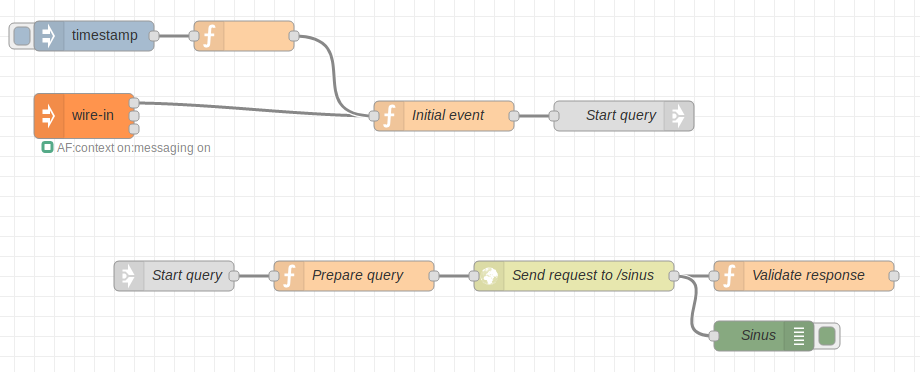

# ApiFlows Tutorial

[TOC](./README.md#table-of-content) 

* [Node-RED basic flow](#node-red-basic-flow)
* [Node-RED basic functional tester](#node-red-basic-functional-tester)
* [ApiFlows load tester](#apiflows-load-tester)
* [ApiFlows load tester step1](#apiflows-load-tester-step1)
* [ApiFlows load tester step2](#apiflows-load-tester-step2)
* [ApiFlows load tester step3](#apiflows-load-tester-step3)
* [Contexts injection](#context-injection)
* [Monitoring](#monitoring)

## Node-RED basic flow

Node-RED already has many different connectors to implement multiple kind of flows. For example, it can act as a web server to provide a service. In the following example, it provides a flow to compute the sinus of an angle provided in the http request's parameters:


Note: To import the flow in your Node-RED instance, follow the instructions [here][import] 

[import]: https://nodered.org/docs/user-guide/editor/workspace/import-export "Node-RED import/export"

The flow can be reached using the NodeRed host name and the path /sinus
```
"http://<flowId>.<accountId>.apivalley.org/sinus?q=32151.1"
```
where the flowId is the one you set when you created the flow
and the accountId can be found using the comand apiflows user list.

## Node-RED basic functional tester

The same principle can used to validate the web service. A flow can be embedded in the same flow as a new tab or can be a flow on its own.


Now, a request to the service can be generated by clicking on the Start Request inject node. It capacity to generate traffic is very limited and not flexible


## ApiFlows load tester

The basic functional tester can be enhanced to generate a traffic on demand, based on those base flows, we can enrich the tester to capture some metrics and/or generate traffic for numerous different contexts objects.


## ApiFlows load tester step1

Send an Injector message to a wire-in node to start a request




This requires to send one Injector message for each request sent to the service


## ApiFlows load tester step2

Using an Injector message from a wire-out node to a wire-in node allows the traffic to continue


[NodeRed load tester step 2.json](flows/NodeRedTesterLoadStep2.json)

For each context injected, there will be one request per second in this example.

## ApiFlows load tester step3

For now, the request sent to the service is always the same. The context can be used to introduce some variations, store and update data related to a context. For example, the current angle can be stored in the context to remember which sinus was already computed. It can be incremented during the next context loop.

A metrics node can be used to store a metric value in time-series database for further analysis. For example, it can be a counter incremented for each sinus computed.


[NodeRed load tester step 3.json](flows/NodeRedTesterLoadStep3.json)

A metric node can also be added to the service to count and validate that the number of requests sent on one side was well proccessed on the other. 

## Contexts injection

The ApiFlows interface allows you to create a group of context from the same data pattern with a unique command:
apiflows context create --flowId myflowid --nb contextsnumber --groupId mygroupid --file /var/contextsTemplate.json
with data pattern file containing a Json object :
```
{
    "data": {"prop1": "value1", "prop2": "value2", "mintemp": 10, "maxtemp": 23},
    "state": "STARTED"
}
```

and then inject them with another command:
apiflows context start --flowId myflowid --groupId mygroupid --wireIn mywirepiname


## Monitoring

The Grafana dashboard is accessible at the address
```
https://grafana.zmeter2.apivalley.org
```
You can create your own dashboard, or import the one associated to the tutorial:

[myGrafanaDashboard.json](flows/LoadStepGrafana.json)


 [Back to top](#apiflows-concepts)